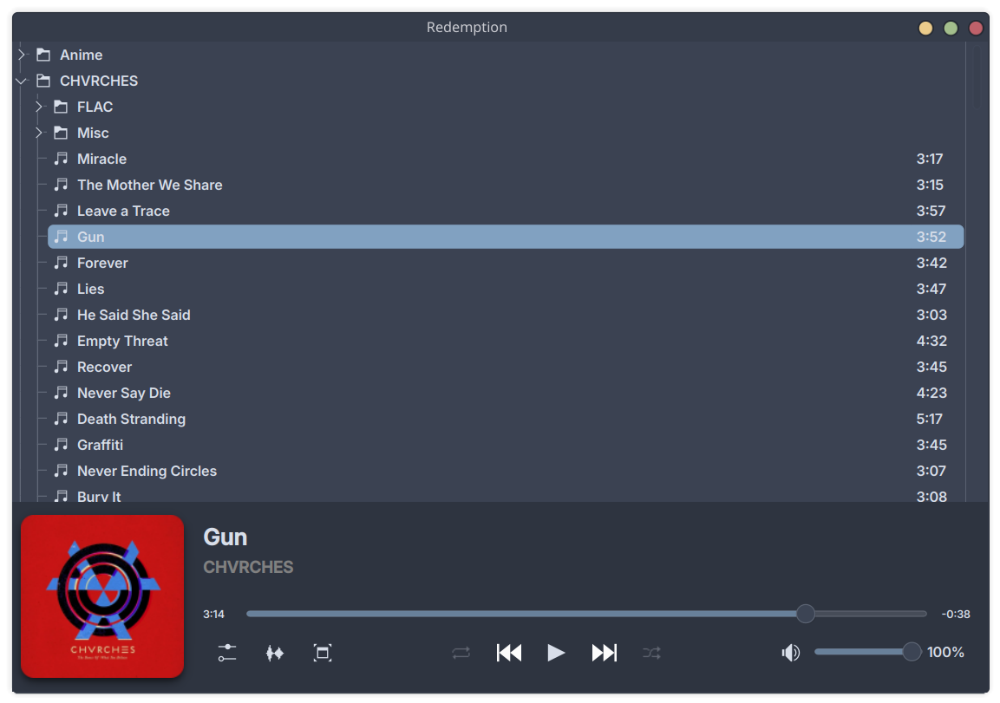
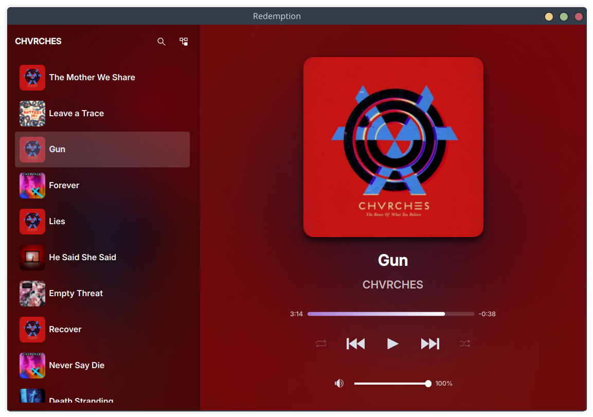

# Redemption

A lightweight music player for KDE/Linux built around your filesystem. Click any song and
Redemption plays it, then continues recursively through everything that follows —
no playlists to manage, no library to import, just your music and your folders.

<table>
  <tr>
    <td></td>
    <td></td>
  </tr>
  <tr>
    <td align="center">Main View</td>
    <td align="center">Playlist View</td>
  </tr>
</table>
## Features

- **Recursive filesystem playback** — play a song, Redemption continues through
  everything that follows in your library
- **Ambient mode** — bottom bar and playlist view adopt colors from the current
  album art with a blurred background and crossfade transitions
- **Playlist view** — a toggleable full-window view with large cover art,
  ambient blurred background, and a song list
- **Loop modes** — loop a single track, directory, specific directory recursively or the full library
- **Shuffle modes** — shuffle a single directory, or all your music
- **MPRIS2** — full media key support and taskbar integration
- **Search** — fast async search across your entire library
- **Metadata editor** — edit tags directly from the player
- **System tray** — hide to tray, control from tray menu
- **Lightweight** — takes up minimal system resources
- **Cava integration** — launch a terminal visualizer with one click

## Dependencies

- Qt6 (Widgets, DBus, Network, Concurrent)
- mpv (libmpv)
- TagLib
- KDE Breeze icon theme (recommended)

On Arch Linux:

```bash
sudo pacman -S qt6-base mpv taglib
```

## Building

```bash
git clone https://github.com/CT-66/Redemption.git
cd Redemption
qmake
make
```

To install system-wide:

```bash
sudo make install
```

This installs the binary to `/usr/bin/Redemption`, a `.desktop` file, and the
app icon.

## Usage

Redemption looks for music in `~/Music`. This path is currently hardcoded —
configurable root path is planned for a future release.

**Keyboard shortcuts:**

| Key                      | Action                            |
| ------------------------ | --------------------------------- |
| Space                    | Play/pause                        |
| `[` / `]`                | Previous / next                   |
| Shift+Left / Shift+Right | Seek backward / forward           |
| Ctrl+F or /              | Search                            |
| Ctrl+M                   | Mute                              |
| Ctrl+[ / Ctrl+]          | Volume down / up                  |
| Ctrl+J / Ctrl+K          | Navigate tree                     |
| Ctrl+I / Ctrl+V or \     | Toggle playlist view              |
| F                        | Toggle fullscreen (playlist view) |
| Ctrl+Q                   | Quit                              |

## Known Limitations

- Music path is hardcoded to `~/Music`
- Search index is built synchronously on first invoke (brief freeze on large
  libraries)

## Privacy

Redemption is entirely local. It reads music files directly from your filesystem
and stores nothing remotely. No analytics, no telemetry, no network requests of
any kind. The only data written to disk is your settings file at
`~/.config/Redemption/settings.ini`.

Cover art is temporarily saved to `/tmp/Redemption/` for MPRIS2 integration
(taskbar widgets and media players that request album art). This is cleared on
each run.

## Platform Support

Redemption currently targets KDE/Linux exclusively. However, since it is built
on Qt6, the core UI and playback logic are largely portable. The main
platform-specific components are:

- **MPRIS2** — Linux/D-Bus media control protocol. Would need replacing with
  SMTC (Windows) or MPNowPlayingInfoCenter (macOS)
- **Icon theme** — relies on KDE Breeze icons from the system. Bundled icons
  would be needed on other platforms
- **D-Bus** — used for single-instance enforcement and MPRIS2

A Windows or macOS port is theoretically feasible with moderate effort, but is
not currently planned.

## Planned

- Configurable root music path
- Remember last played track and position
- AUR package
- Loop/shuffle state persistence
- Bookmarks/favorites
- Configurable keyboard shortcuts
- Cross-platform support

## License

GPL-3.0
